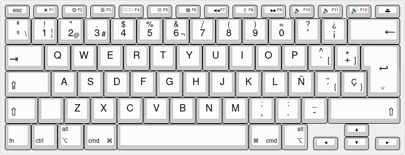

lhw4 – Custom Apple Keyboard Layout for Linux (MacBook Pro)
📸 Physical Apple Keyboard Layout (MacBook Pro)

Real photo of the keyboard used to create and test the lhw4 layout:

  

This project provides a fixed and reliable XKB keyboard layout for Apple
MacBook Pro keyboards (ISO), especially useful on Linux distributions such as
Linux Mint and Ubuntu.

It solves long-standing issues commonly found when using Apple keyboards on Linux.

🔧 What problems does this layout fix?

Broken or swapped / and ?

Missing or incorrect ç

Broken dead keys (~ ´ ^)

Incorrect AltGr combinations

Misplaced symbols on Apple ISO keyboards

Note:
The | symbol is available as AltGr + ~
(~ is the physical key labeled as Ñ on Apple ISO keyboards).

Originally created as a custom Windows layout (MSKLC)
and later converted to XKB with extensive manual fixes, testing,
stubborn persistence — and a generous amount of Jack & Coke. 🍹

🎯 Who is this for?

This layout is for you if:

You use a MacBook Pro with an Apple ISO keyboard

You run Linux (Mint, Ubuntu, Debian-based)

You want Brazilian ABNT2 behavior

You are tired of broken layouts and hacks that almost work

✅ What works?

All letters correctly mapped

Dead keys (´ ^ ~`) working 100%

Fully functional ç key

Symbols in their correct physical positions

No swapped keys (A ≠ I 😅)

Consistent Brazilian keyboard behavior

🖼 Keyboard layout (visual reference)

This image was generated using **Keyboard Layout Editor (KLE)** and reflects
the real behavior of the `lhw4` XKB layout.

💻 Tested systems

Linux Mint Cinnamon

MacBook Pro (Apple ISO keyboard)

🛠 Installation
git clone https://github.com/Lehwing/lhw4-macbook-keyboard.git
cd lhw4-macbook-keyboard
chmod +x install.sh
./install.sh

🧩 Visual layout (KLE)

This project includes a full visual layout created using  
Keyboard Layout Editor (KLE).

The source file is available in:
- `kle/lhw4.kle.json`

You can load this file directly at:
https://keyboard-layout-editor.com

📸 Physical layout of the Apple Keyboard (MacBook Pro)

Real photograph of the keyboard used created and test the layout **lhw4**:

	

🖼 Activation

After installation, enable the layout:

System Settings → Keyboard → Layouts
Look for the installed layout lhw4

Or via terminal:

setxkbmap -layout lhw4

🔙 Reverting to the default layout

System Settings → Keyboard → Layouts → Restore Defaults

Or via terminal:

setxkbmap -layout br

👥 Authors

Created, compiled and tested by Dani & Ari 🧵✨
Electronics engineers, hobbyists and unapologetic tinkerers.

This project was born from persistence, curiosity,
and a deep refusal to accept “almost working” solutions.
