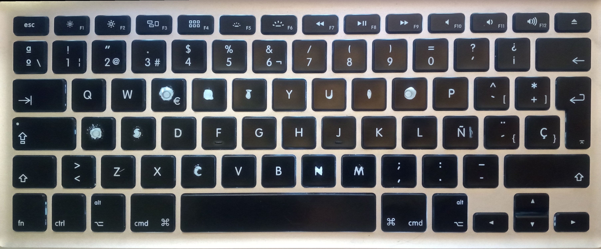

# lhw4 – Layout custom de teclado Apple para Linux (MacBook Pro)

- Layout de teclado **ABNT2 funcional** para **teclados Apple ISO (MacBook Pro)** no Linux.  
- Chega de teclas quebradas, símbolos fora do lugar e gambiarra eterna.
- Porque teclado Apple no Linux **pode** funcionar direito.  
- E agora funciona. 😌⌨️


---

## 📸 Layout físico do teclado Apple (MacBook Pro)

Foto real do teclado usado para criar e testar o layout **lhw4**:

<p align="center">
	
</p>

Este projeto fornece um layout de teclado **XKB corrigido** para teclados Apple  
(MacBook Pro), especialmente útil em distribuições Linux como **Linux Mint** e **Ubuntu**.

O layout resolve problemas comuns como:

- "/" e "?"
- "ç"
- "~ ´ ^"
- Combinações com "AltGr"
- Símbolos deslocados em teclados Apple

**Obs.:**  
O símbolo `|` existe como `AltGr+~`  
(`~` é a tecla fisicamente marcada como `Ñ` no teclado Apple ISO).

Criado originalmente a partir de um layout personalizado no Windows (MSKLC)  
e convertido para XKB com ajustes finos, persistência, teimosia técnica  
e Jack & Coke em profusão. 🍹

---

## 🎯 Para quem é esse projeto?

Esse layout é para você se:

- Você usa um **MacBook Pro (teclado Apple ISO)**
- Você roda **Linux** (Mint, Ubuntu, Debian-based)
- Você quer **comportamento de ABNT2 brasileiro**
- Você está cansado(a) de layouts quebrados, hacks e mods que “quase” funcionam

---

## ✅ O que funciona?

- Todas as letras corretamente mapeadas
- Dead keys (`´ ` ^ ~`) funcionando 100%
- Tecla **ç** totalmente funcional
- Símbolos em suas posições corretas
- Nenhuma tecla trocada (A ≠ I 😅)
- Comportamento consistente com layout brasileiro

## 🗺️ Mapa rápido de teclas especiais

| Tecla física (Apple ISO) | Resultado |
|--------------------------|-----------|
| [AltGr + ~]              | [|]       |
| [´ + vogal]              | Á É Í Ó Ú |
| [` + vogal]	           | À È Ì Ò Ù |
| [^ + vogal]              | Â Ê Î Ô Û |
| [~ + vogal]              | Ã Õ       |
| [¨ + vogal]              | Ä Ë Ï Ö Ü |
| Tecla ao lado do Enter   | [ç]       |

---

## 💻 Sistemas testados

- Linux Mint Cinnamon
- MacBook Pro (teclado Apple – ISO)

---

## 🧩 Layout visual (KLE)

Este projeto inclui um layout visual completo criado com o
**Keyboard Layout Editor (KLE)**.

O arquivo-fonte está disponível em:
- `kle/lhw4.kle.json`

Você pode carregar esse arquivo diretamente em:
https://keyboard-layout-editor.com

---

## 🛠 Instalação

```bash
git clone https://github.com/Lehwing/lhw4-macbook-keyboard.git
cd lhw4-macbook-keyboard
chmod +x install.sh
./install.sh
```

---

## 🎮 Autores

Criado, depurado e testado por **Dani & Ari** 🧵✨  
Engenheiros eletrônicos, hobbistas e inventores amadores.

Este projeto nasceu da persistência, curiosidade  
e da recusa absoluta em aceitar “quase funciona”.

---

## ❓ FAQ

**Funciona em MacBook Air?**  
Provavelmente sim, desde que o teclado seja Apple ISO.

**Funciona em Wayland?**  
Sim, desde que o sistema use XKB (Mint, Ubuntu e derivados).

**Substitui layouts existentes?**  
Não. O layout "lhw4" é adicionado como opção extra.

**Posso remover depois?**  
Sim. Basta apagar o arquivo:
"/usr/share/X11/xkb/symbols/lhw4"
